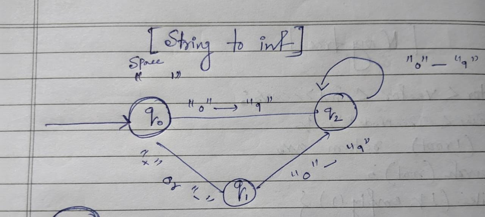

### Problem Statement

Implement the myAtoi(string s) function, which converts a string to a 32-bit signed integer (similar to C/C++'s atoi function).

The algorithm for myAtoi(string s) is as follows:

- Read in and ignore any leading whitespace.
- Check if the next character (if not already at the end of the string) is '-' or '+'. Read this character in if it is either. This determines if the final result is negative or positive respectively. Assume the result is positive if neither is present.
- Read in next the characters until the next non-digit character or the end of the input is reached. The rest of the string is ignored.
- Convert these digits into an integer (i.e. "123" -> 123, "0032" -> 32). If no digits were read, then the integer is 0. Change the sign as necessary (from step 2).
- If the integer is out of the 32-bit signed integer range [-231, 231 - 1], then clamp the integer so that it remains in the range. Specifically, integers less than -231 should be clamped to -231, and integers greater than 231 - 1 should be clamped to 231 - 1.
- Return the integer as the final result.
### Note:

- Only the space character ' ' is considered a whitespace character.
- Do not ignore any characters other than the leading whitespace or the rest of the string after the digits.

### Intuition

The given code implements the `myAtoi` function, which converts a string to an integer. Here's the intuition behind the algorithm, along with the time and space complexity analysis:

1. Initialize variables:
   - `val`: to store the resulting integer value.
   - `pos`: a pointer to iterate through the string.
   - `sign`: to store the sign of the integer (default is positive).
   - `state`: to represent the current state of the DFA (Deterministic Finite Automaton).

2. Check if the input string is empty. If it is, return 0.

3. Iterate through the characters of the string using the `pos` pointer.

4. Implement a Deterministic Finite Automaton (DFA) with states:
   - State 0: Initial state. Skip leading whitespace characters. If the character is '+' or '-', update the sign accordingly. If the character is a digit, transition to state 2 and update the integer value.
   - State 1: If the character is a digit, transition to state 2 and update the integer value. Otherwise, exit the loop.
   - State 2: Continue reading digits and updating the integer value.

5. Adjust the sign of `val` based on the `sign` variable.

6. Ensure that `val` is within the range of a 32-bit signed integer. If it exceeds the maximum or minimum value, set `val` to the corresponding limit.

7. Finally, return the resulting integer value `val`.

Time Complexity:
- The algorithm iterates through the string once, performing a constant number of operations for each character.
- Therefore, the time complexity of the algorithm is O(n), where n is the length of the input string.

Space Complexity:
- The space complexity is O(1) because the algorithm uses a constant amount of additional space to store variables and perform calculations.

In summary:
- Time complexity: O(n) - Linear time complexity, where n is the length of the input string.
- Space complexity: O(1) - Constant space complexity.

# DFA Diagram
    

